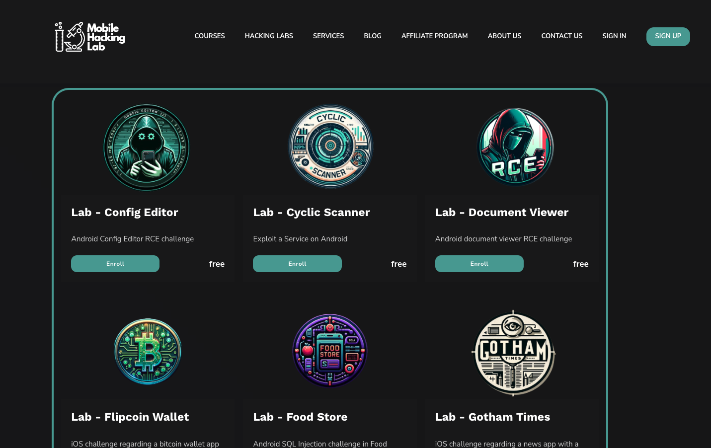
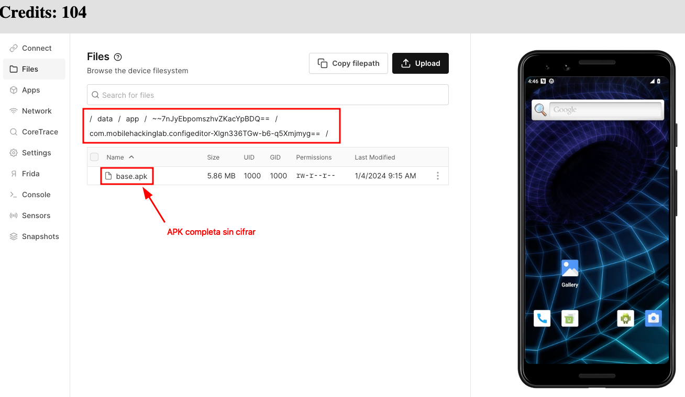

# The Mobile Hacking Lab: Config Editor


## Introducción

Hace poco, me encontré navegando por internet una página bastante interesante llamada [The Mobile Hacking Lab](https://www.mobilehackinglab.com/). En esta web, una vez registrados, podemos probar los laboratorios que tienen y la verdad es que me encantó. No se queda en absoluto en los típicos ejercicios de pentest regular, con un payload hecho con _msfvenom_ y poco más.  



En esta ocasión le dí una oportunidad a "Config Editor". Como se puede apreciar, se trata de un lab para intentar realizar un Remote Code Execution (en base a la explotación de una librería vulnerable, pero eso lo veremos en un momento)

## Walkthrough

_First things first_, iniciamos el laboratorio y nos descargamos la APK en cuestión. Aquí no voy a entrar a cómo se configura el labo, si queréis darle una oportunidad podéis verlo de manera gratuita. Sólo comentaré que tiene un explorador de ficheros y podemos descargarnos el fichero ___base.apk___ localizado dentro de todos los bundles de Android (sí, para el que no lo sepa, las apks se guardan tal cual en memoria local).



Una vez descargada, podemos hacer un par de cosas, pasarla por el mítico [MobSF](https://github.com/MobSF/Mobile-Security-Framework-MobSF) o decompilarla "a mano". Yo, en esta ocasión lancé una instancia de _MobSF_, ya que no lo tenía instalado y así aprovechaba.

De la ejecución de la herramienta, puedo decir que suelo usar _Docker_ para ello. Es mucho más simple de configurar y para iOS además no suele dar problemas. Con esto dicho, la última versión se me quedaba atascada en mitad del análisis, así que tuve que usar una versión anterior con los siguientes comandos:

```console
w1s3m4n@w1seh0st:~$ docker pull opensecurity/mobile-security-framework-mobsf:v3.9.7

w1s3m4n@w1seh0st:~$ docker run -it --rm --name mobsf -p 8000:8000 -v /home/w1s3m4n/Documents/tools/mobile/MobSF/:/home/mobsf/.MobSF opensecurity/mobile-security-framework-mobsf:v3.9.7
```
